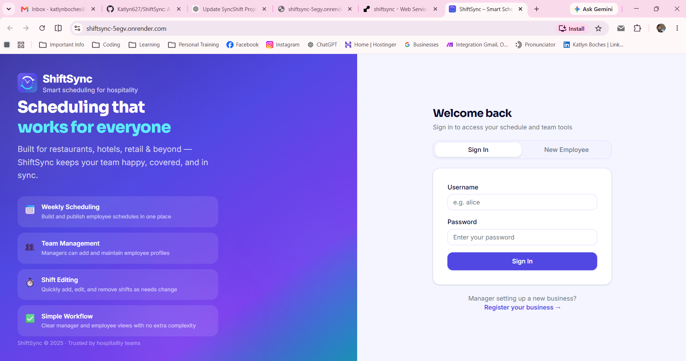
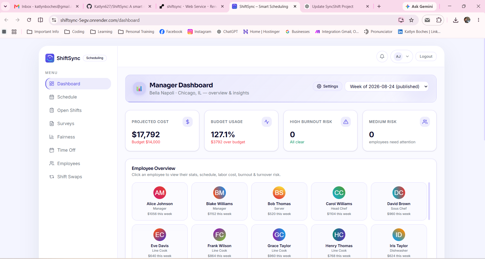
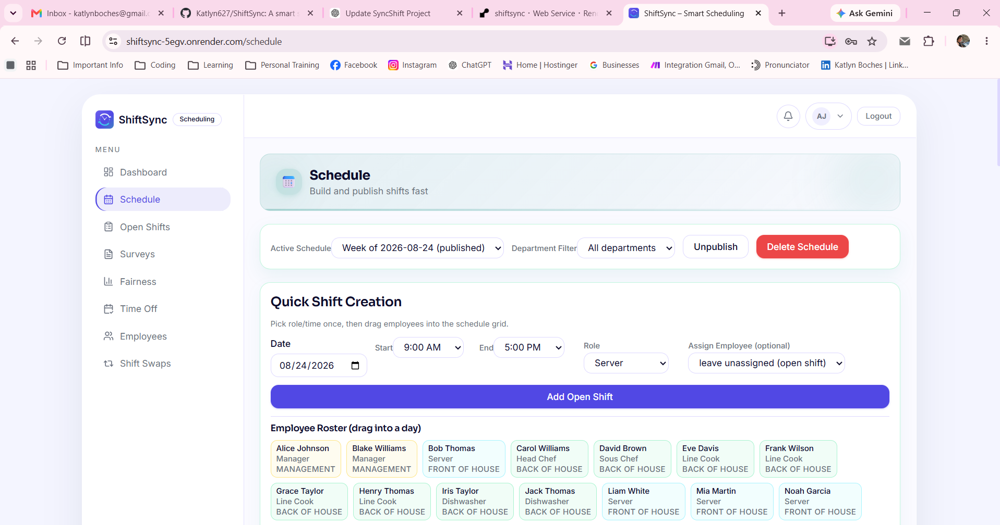
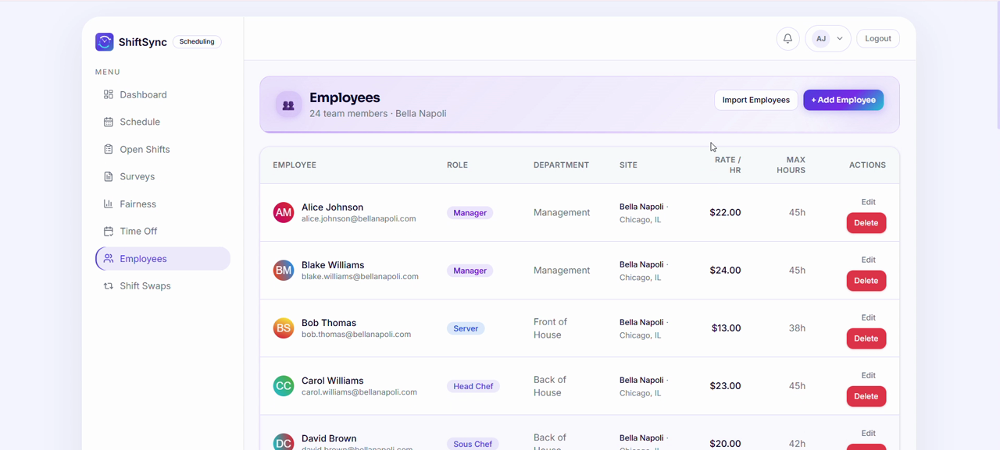
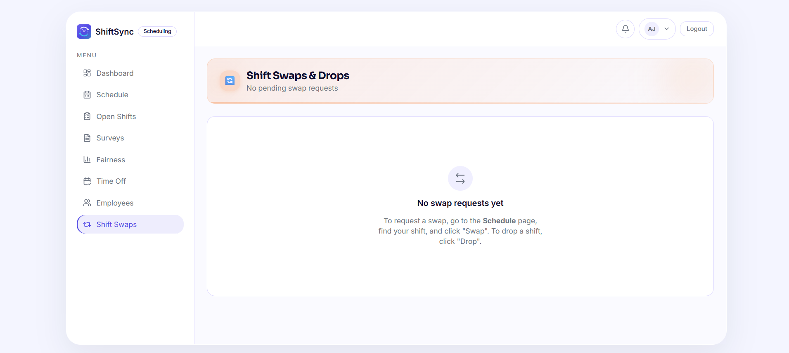
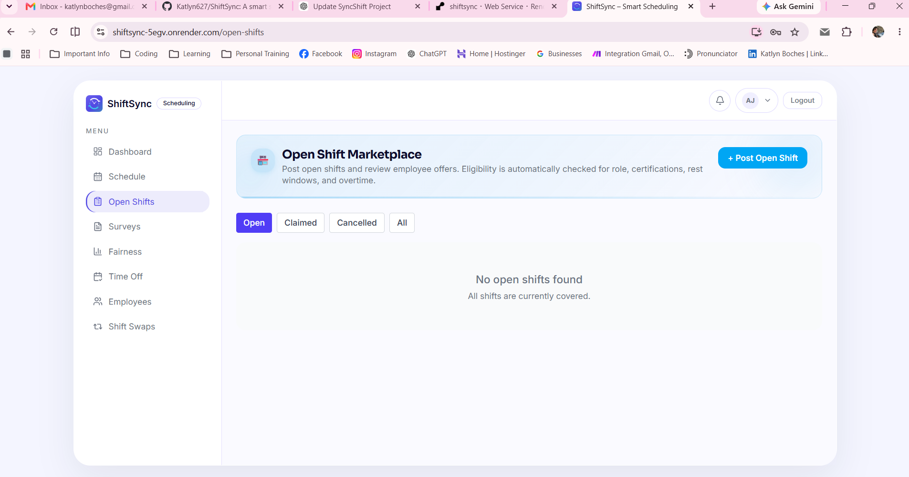
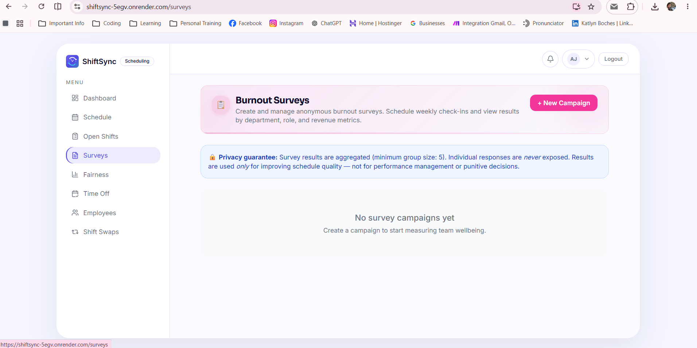
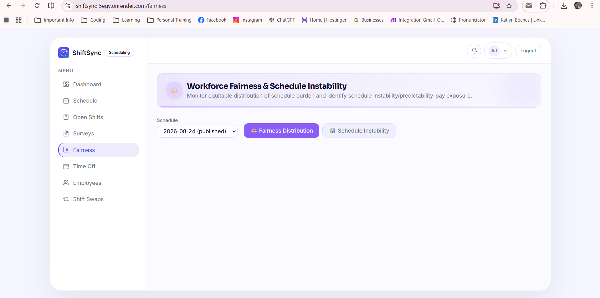
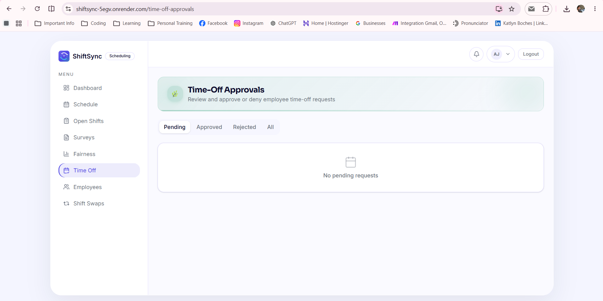

<div align="center">

# ShiftSync

**Simple manager/employee scheduling app**

[](https://nodejs.org)
[](https://react.dev)
[](https://www.typescriptlang.org)
[](https://github.com/WiseLibs/better-sqlite3)
[](https://tailwindcss.com)
[](LICENSE)

</div>

---

## 🌐 Live Demo

**[Open the live ShiftSync application](https://shiftsync-5egv.onrender.com)**

Demo manager login:

- **Username:** `alice`
- **Password:** `password123`

> The application runs on Render’s free tier. The first visit after inactivity may take up to 60 seconds while the service wakes up. Demo data may reset after a restart or new deployment.

---

## Table of Contents

- [Features](#-features)
- [Screenshots](#-screenshots)
- [Getting Started](#-getting-started)
- [Tech Stack](#-tech-stack)
- [API Reference](#-api-reference)
- [Product Requirements](#-product-requirements)
- [License](#-license)

---

## ✨ Features

| | Feature | Description |
|---|---|---|
| 📅 | **Weekly Scheduling** | Create, view, and publish weekly schedules |
| 👥 | **Employee Management** | Add, update, and organize team members |
| 🕒 | **Shift Management** | Add, edit, reassign, and delete shifts |
| 🔐 | **Role-Based Access** | Separate manager and employee access with secure login |

---

## 🖼 Screenshots

### Login

<p align="center">
  
</p>

### Manager Dashboard

<p align="center">
  
</p>

### Schedule Builder

<p align="center">
  
</p>

### Employees & Shift Swaps

<table>
  <tr>
    <td width="50%">
      
      <br/>
      <strong>Employee Management</strong> — Review employee roles, departments, locations, pay rates, and maximum weekly hours.
    </td>
    <td width="50%">
      
      <br/>
      <strong>Shift Swaps & Drops</strong> — Review employee swap and drop requests through a clear manager workflow.
    </td>
  </tr>
</table>

### Open Shifts & Surveys

<table>
  <tr>
    <td width="50%">
      
      <br/>
      <strong>Open Shift Marketplace</strong> — Post uncovered shifts and manage employee offers with eligibility checks.
    </td>
    <td width="50%">
      
      <br/>
      <strong>Burnout Surveys</strong> — Create anonymous wellbeing campaigns with privacy-focused, aggregated results.
    </td>
  </tr>
</table>

### Fairness & Time-Off

<table>
  <tr>
    <td width="50%">
      
      <br/>
      <strong>Workforce Fairness</strong> — Monitor equitable workload distribution and schedule instability.
    </td>
    <td width="50%">
      
      <br/>
      <strong>Time-Off Approvals</strong> — Review requests and filter them by approval status.
    </td>
  </tr>
</table>

---

## 🚀 Getting Started

### Prerequisites

- **Node.js** 20 or later
- **npm** 9 or later

### 1. Clone & install

```bash
git clone https://github.com/Katlyn627/ShiftSync.git
cd ShiftSync

# Install everything from the repo root
npm install          # installs concurrently (used by root dev script)
cd server && npm install && cd ..
cd client && npm install && cd ..
```

### 2. Configure environment variables

The server reads a **`server/.env`** file. Copy the provided template:

```bash
cp server/.env.example server/.env
```

Open `server/.env` and fill in the values (inline comments explain each one).
The most important variables before first run:

| Variable | Default | Purpose |
|---|---|---|
| `PORT` | `3001` | Port the Express server listens on |
| `JWT_SECRET` | — | Secret used to sign JWTs — **required in production** |
| `SESSION_SECRET` | — | Secret for the OAuth session cookie — **required in production** |
| `DB_PATH` | `./shiftsync.db` | Path to the SQLite database file |
| `CLIENT_URL` | `http://localhost:3000` | React frontend origin (used for OAuth redirect) |

> **`server/.env` is listed in `.gitignore` and will never be committed. Never commit real secrets.**

#### Enabling Google OAuth *(optional)*

1. Go to [Google Cloud Console → Credentials](https://console.cloud.google.com/apis/credentials) and create an **OAuth 2.0 Client ID** (type: *Web application*).
2. Add the callback URL to **Authorised redirect URIs**:
   - **Local:** `http://localhost:3001/api/auth/google/callback`
   - **Production:** `https://<your-domain>/api/auth/google/callback`

   > The callback is served by the Express server on port **3001**, not the Vite dev-server on port 3000. Registering the wrong port is the most common cause of `Error 400: redirect_uri_mismatch`.

3. Add the credentials to `server/.env`:

   ```env
   GOOGLE_CLIENT_ID=your-client-id.apps.googleusercontent.com
   GOOGLE_CLIENT_SECRET=your-client-secret
   CLIENT_URL=http://localhost:3000
   ```

`GOOGLE_CALLBACK_URL` is **optional** — when omitted the server derives it automatically from the incoming request, which works for both local dev and production without extra configuration.

If `GOOGLE_CLIENT_ID` or `GOOGLE_CLIENT_SECRET` are blank, `/api/auth/google` returns `503` and the Google sign-in button is hidden from the UI. Username/password login still works.

<details>
<summary><strong>Troubleshooting <code>Error 400: redirect_uri_mismatch</code></strong></summary>

| Cause | Fix |
|-------|-----|
| Registered `http://localhost:3000/…` (frontend) instead of `http://localhost:3001/…` (backend) | Update the URI in Google Cloud Console to port **3001** |
| `GOOGLE_CALLBACK_URL` is set to a `localhost` URL in a production deployment | Remove the override or set it to the correct production URL |
| Production domain in Google Cloud Console doesn't match deployed domain | Register `https://<your-domain>/api/auth/google/callback` |

When the server starts with Google OAuth configured it prints the effective callback URL to the console — use that as a reference.

</details>

### 3. Run development servers

```bash
# From the repo root — starts both servers concurrently
npm run dev

# Or run them separately:
# Terminal 1 – backend  (http://localhost:3001)
cd server && npm run dev

# Terminal 2 – frontend (http://localhost:3000)
cd client && npm run dev
```

Open **http://localhost:3000** in your browser.

32 demo accounts are pre-loaded across 4 sites. Use a manager account to access all features:

| Username | Role | Site | Password |
|---|---|---|---|
| `alice` | Manager | Bella Napoli (Restaurant, Chicago) | `password123` |
| `iris` | Manager | The Blue Door (Restaurant, Austin) | `password123` |
| `quinn` | Manager | Grand Pacific Hotel (Hotel, New York) | `password123` |
| `yara` | Manager | Seaside Suites & Spa (Hotel, Miami) | `password123` |

For the complete list of all 32 accounts (including employee-role accounts), see [docs/demo-data.md](docs/demo-data.md).

### 4. Run tests

```bash
# From the repo root
npm test

# Or individually:
cd server && npm test
cd client && npm test
```

---

## 🛠 Tech Stack

| Layer | Technologies |
|---|---|
| **Frontend** | React 18 · TypeScript · Vite · Tailwind CSS 4 · Recharts · React Router 6 · Radix UI |
| **Backend** | Node.js · Express · TypeScript · better-sqlite3 (SQLite) |
| **Auth** | JWT (username/password) · Passport.js + Google OAuth 2.0 |
| **Testing** | Vitest (client) · Jest + Supertest (server) |

---

## 📡 API Reference

### Employees

| Method | Path | Description |
|--------|------|-------------|
| `GET` | `/api/employees` | List all employees |
| `POST` | `/api/employees` | Create an employee |
| `PUT` | `/api/employees/:id` | Update an employee |
| `DELETE` | `/api/employees/:id` | Delete an employee |
| `GET` / `POST` | `/api/employees/:id/availability` | Get or set availability rules |

### Schedules & Shifts

| Method | Path | Description |
|--------|------|-------------|
| `GET` | `/api/schedules` | List schedules |
| `POST` | `/api/schedules/generate` | Auto-generate a schedule |
| `GET` | `/api/schedules/:id/shifts` | Get shifts for a schedule |
| `GET` | `/api/schedules/:id/labor-cost` | Labor cost summary |
| `GET` | `/api/schedules/:id/burnout-risks` | Burnout risk analysis |
| `GET` | `/api/schedules/:id/profitability-metrics` | Profitability metrics (prime cost, RevPASH, sales by day, etc.) |
| `PUT` | `/api/schedules/:id` | Update schedule (publish / draft) |
| `PUT` | `/api/shifts/:id` | Update a single shift |

### Shift Swaps

| Method | Path | Description |
|--------|------|-------------|
| `GET` | `/api/swaps` | List swap requests |
| `POST` | `/api/swaps` | Submit a swap request |
| `PUT` | `/api/swaps/:id/approve` | Approve a swap |
| `PUT` | `/api/swaps/:id/reject` | Reject a swap |

### Forecasts & Auth

| Method | Path | Description |
|--------|------|-------------|
| `GET` / `POST` | `/api/forecasts` | Get or upsert revenue forecasts |
| `POST` | `/api/auth/login` | Username/password login |
| `POST` | `/api/auth/register` | Register a new user account |
| `GET` | `/api/auth/google` | Initiate Google OAuth flow |
| `GET` | `/api/auth/google/callback` | Google OAuth callback |

---

## 📋 Product Requirements

ShiftSync is designed as an integrated system — **workflow + rule engine + measurement + governance** — to meaningfully reduce burnout risk, not just automate scheduling.

For the full product requirements, data needs, governance guidelines, and validation plan, see:

**[docs/product-requirements.md](docs/product-requirements.md)**

---

## 📄 License

ShiftSync uses a **dual-license model**:

- **Community License (non-commercial/evaluation use):** [LICENSE](LICENSE)
- **Commercial License (required for business/commercial self-host use):** [COMMERCIAL_LICENSE.md](COMMERCIAL_LICENSE.md)

For hosted SaaS access, trial onboarding, or commercial licensing, contact: **sales@shiftsync.app**
